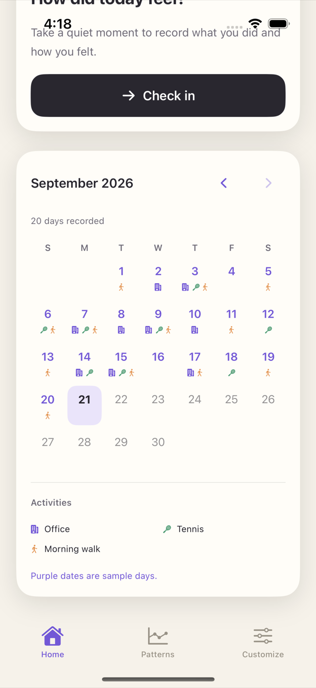
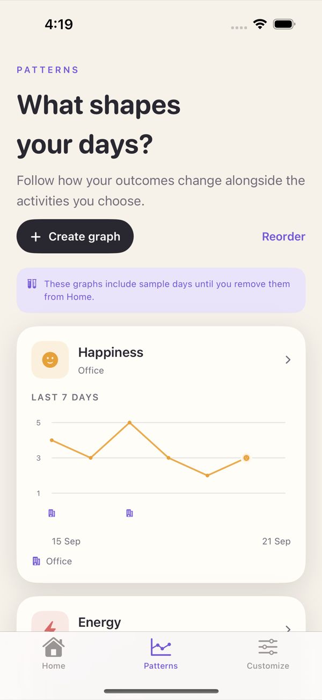
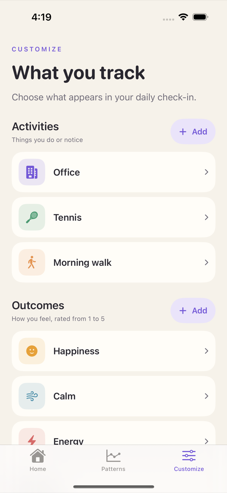
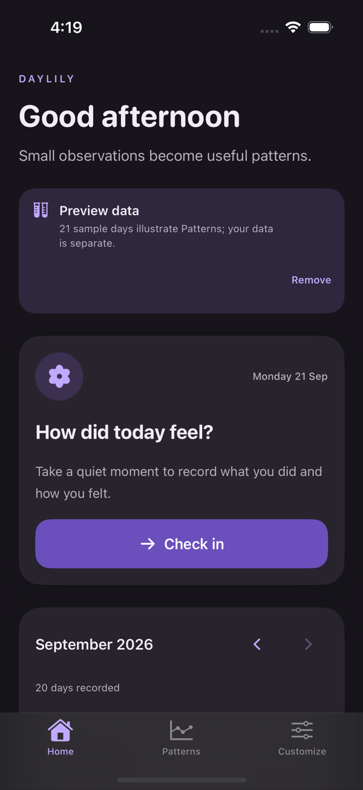
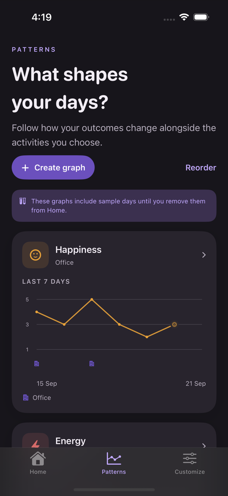
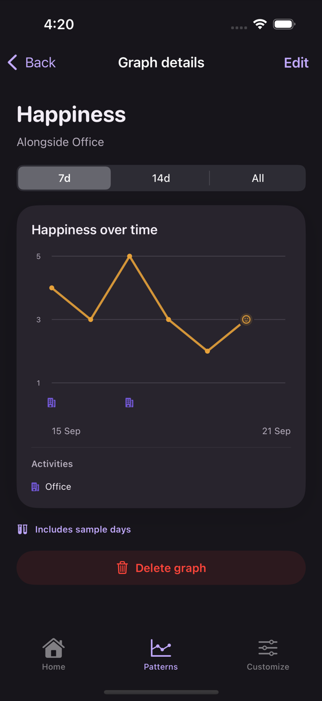

<div align="center">


# Daylily

Log what you did, rate how you felt, and see which activities line up with which outcomes.

[](#build)
[](#build)
[](#license)

</div>

A SwiftUI app. Everything stays on the device: no account, server, sync, or analytics.

## Screenshots

<table>
  <tr>
    <td align="center" width="33%"><br><sub><b>Home</b></sub></td>
    <td align="center" width="33%"><br><sub><b>Calendar</b></sub></td>
    <td align="center" width="33%"><br><sub><b>Check in</b></sub></td>
  </tr>
  <tr>
    <td align="center" width="33%"><br><sub><b>Patterns</b></sub></td>
    <td align="center" width="33%"><br><sub><b>Graph details</b></sub></td>
    <td align="center" width="33%"><br><sub><b>Customize</b></sub></td>
  </tr>
  <tr>
    <td align="center" width="33%"><br><sub><b>Home</b></sub></td>
    <td align="center" width="33%"><br><sub><b>Patterns</b></sub></td>
    <td align="center" width="33%"><br><sub><b>Graph details</b></sub></td>
  </tr>
</table>

Follows the system appearance; on iPad the layout stays a centered column rather than stretching.

## Build

Open `Daylily.xcodeproj` in Xcode, pick a simulator, run. Requires iOS 17+ and Xcode 15+.

No signing team is configured, which keeps the project portable: simulator builds need none, and device builds need you to pick your own once under **Signing & Capabilities**.

The project is generated from `project.yml` with [XcodeGen](https://github.com/yonaskolb/XcodeGen).

## Tests

```
xcodebuild test -scheme Daylily -destination 'platform=iOS Simulator,name=iPhone 16,OS=18.2'
```

87 unit tests plus one UI test covering graph reordering.

## Sample data

Debug builds seed 21 sample days and two sample graphs so Patterns is not empty on first launch. One action on Home removes both. Release builds never generate them.

## Data

State is versioned JSON in `UserDefaults`, with the previous save kept as a fallback and a recovery screen that will not overwrite unreadable data. Export a backup from Customize before deleting the app or changing phones.

## License

MIT
