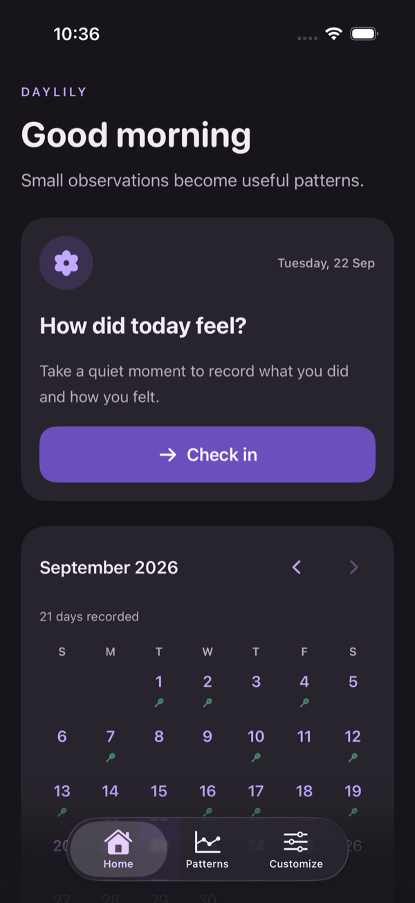
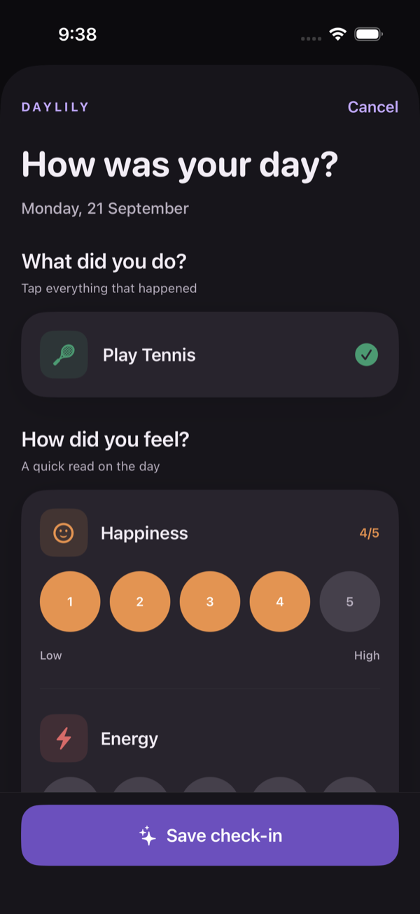
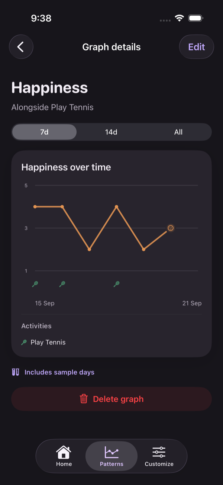

# Daylily

An iOS app for tracking which activities line up with how you feel. 

Each day you log what you did and rate the outcomes. Patterns plots those ratings over time with the activity days
marked underneath. Everything's stored locally.

## Screenshots

<table>
  <tr>
    <td width="33%" align="center" valign="top">
        
      <b>Home</b> 
      Today's check-in and the month below, with icons on days you logged.
    </td>
    <td width="33%" align="center" valign="top">
        
      <b>Check in</b> 
      Tap what you did, rate how you felt 1–5.
    </td>
    <td width="33%" align="center" valign="top">
        
      <b>Graph detail</b> 
      One line per outcome. Unrated days leave a gap.
    </td>
  </tr>
</table>

## Building

Xcode 16+. Open `Daylily.xcodeproj` and run. The project is generated from `project.yml` with
[XcodeGen](https://github.com/yonaskolb/XcodeGen).

## License

MIT

